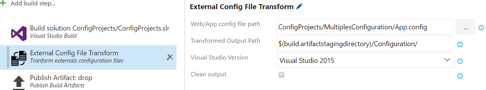

## Xml Transforme Tasks ##

This extension provide build tasks for xml configuration files.

### External configuration file tranformer ###

This task tranform configuration xml files that include in Web.configuration or App.configuration

 

**Web/App config file path** select the path of the Web.config or App.config that include other configuration.

**Transformed Output Path** output path that configuration files will be tranform.

**Visual Studio Version** The visual studio version to use for get the path of the XmlTransform.dll

**Clean output** If checked the task delete the xdt files that in the output path after the tranformation